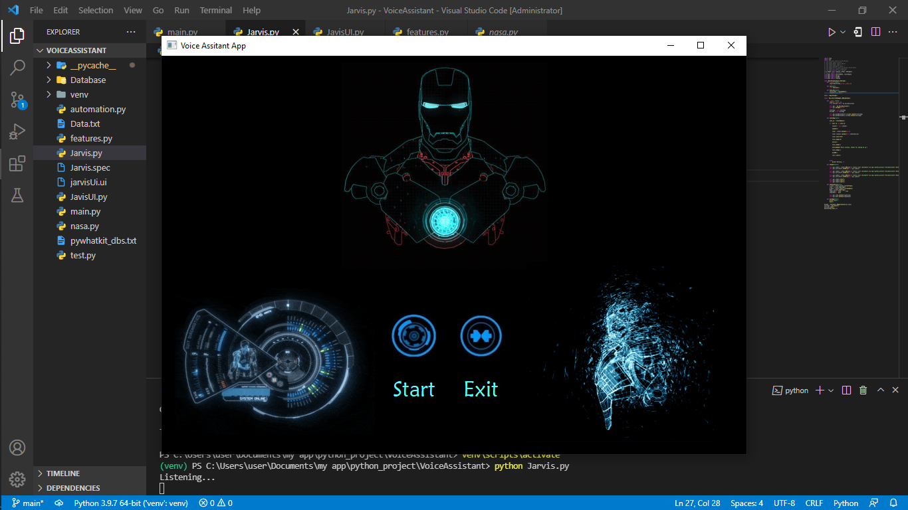

# Jarvis Voice Assistant

I built this website was actually to help me do some task, such as open up google, vscode, spotify, youtube, and so on. Tools i use is Speech Recognition and Voice engine from python.

Jarvis can do
- Youtube Search
- Google Search
- Wikipedia Search
- Whatsapp Automation
- Small Talk
- Jokes
- Singing
- NASA News
- Alarm

How to start 
1. Create Virtual Env
2. Activate Virtual Env
3. Pip install requirements.txt
4. Run python Jarvis.py

## Example

